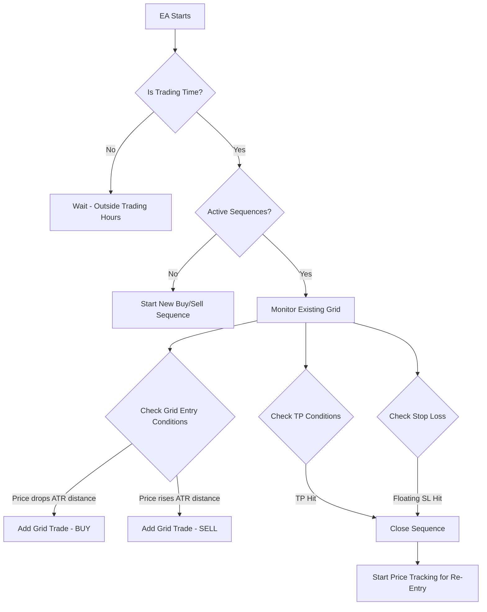
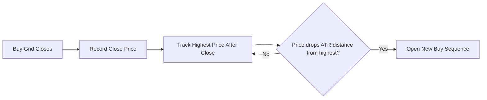
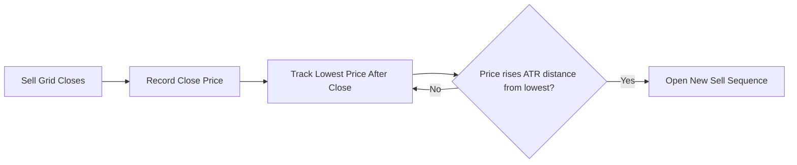
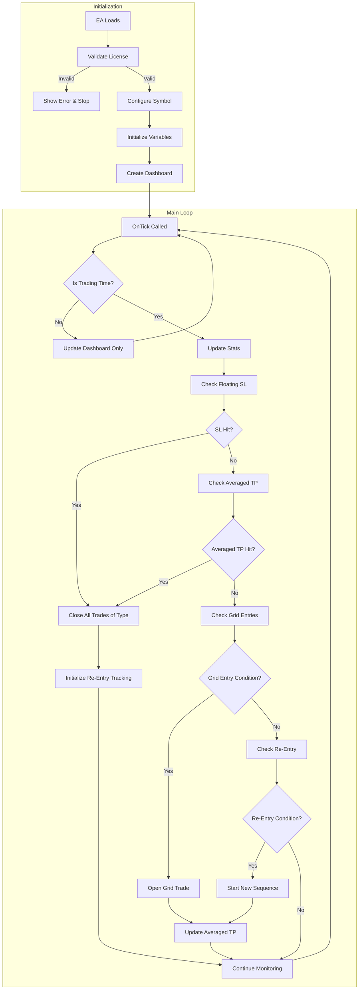

# 🏆 AURUM Personal Version - ATR Grid Trading Strategy

> **Expert Advisor for MetaTrader 4**  
> Gold Grid with Enhanced Stop Loss & Averaged Take Profit System

---

## 📋 Table of Contents

1. [Strategy Overview](#strategy-overview)
2. [Core Trading Logic](#core-trading-logic)
3. [Entry Conditions](#entry-conditions)
4. [Grid System](#grid-system)
5. [Take Profit Modes](#take-profit-modes)
6. [Stop Loss System](#stop-loss-system)
7. [Re-Entry Logic](#re-entry-logic)
8. [Symbol Configuration System](#symbol-configuration-system)
9. [Input Parameters](#input-parameters)
10. [Dashboard & Visualization](#dashboard--visualization)
11. [License System](#license-system)
12. [Quick Reference Flowchart](#quick-reference-flowchart)

---

## Strategy Overview

The **AURUM Personal Version** is an automated grid trading Expert Advisor (EA) designed primarily for Gold (XAUUSD) but supports multiple asset classes including Forex pairs, Silver, Crypto, Indices, and Commodities.

### Key Features

| Feature | Description |
|---------|-------------|
| **Grid Trading** | Opens multiple trades at ATR-based distance intervals |
| **Dual Direction** | Can trade both BUY and SELL sequences independently |
| **ATR-Based** | Uses Average True Range for dynamic positioning |
| **Two TP Modes** | Individual TP per trade OR Averaged TP for entire grid |
| **Floating Stop Loss** | Dollar-based stop loss per trading direction |
| **Smart Re-Entry** | Tracks price extremes after grid closure for optimal re-entry |
| **Universal Symbol** | Auto-configures for different asset types |

---

## Core Trading Logic

### How the Strategy Works (Step by Step)



### Trading Time Control

The EA only trades during specified hours:

- **Start Day**: Monday (1) to Sunday (7)
- **Start Time**: Hour of day (0-23)
- **Stop Day**: Monday (1) to Sunday (7)  
- **Stop Time**: Hour of day (0-23)

**Default Schedule**: Monday 9 AM → Friday 4 PM (Broker Server Time)

---

## Entry Conditions

### Initial Trade Entry

When **no active sequences exist** and it's within trading hours:

1. **BUY Sequence**: Places a market BUY order at current ASK price
2. **SELL Sequence**: Places a market SELL order at current BID price

> [!NOTE]
> The EA can run both BUY and SELL sequences **simultaneously and independently**.

### Entry Requirements

- Trading hours must be active
- Spread check passes (currently always returns `true`)
- Enable_Buy_Trades / Enable_Sell_Trades must be `true`
- No re-entry waiting period active (if enabled)

---

## Grid System

### How Grid Entries Work

The grid system adds new trades when price moves **against** the initial position by an ATR distance.

#### BUY Grid Logic
```
New BUY trade opens when:
  Current BID ≤ (Last Buy Price - Buy_ATR_Grid_Distance)
```

#### SELL Grid Logic
```
New SELL trade opens when:
  Current ASK ≥ (Last Sell Price + Sell_ATR_Grid_Distance)
```

### ATR Grid Distance Calculation

```
Grid Distance = iATR(Buy_ATR_TF_Grid, 14, 0)
```

The ATR is fetched from the specified timeframe (default: M15) using 14 periods.

### Grid Trade Limits

| Direction | Parameter | Default |
|-----------|-----------|---------|
| BUY | `Buy_Max_Trades` | 10 |
| SELL | `Sell_Max_Trades` | 10 |

> [!IMPORTANT]
> Each grid trade uses the **same lot size** as the initial trade. This is NOT a Martingale system - lot sizes remain constant.

### Visual Example - Buy Grid Building

```
Price
↑
│         Initial Buy @ 2000
│              ↓
│    ─────────●──────────────  BUY #1 (Entry)
│              │
│              │ ATR Distance
│              ↓
│    ─────────●──────────────  BUY #2 (Grid)
│              │
│              │ ATR Distance
│              ↓
│    ─────────●──────────────  BUY #3 (Grid)
│
└────────────────────────────→ Time
```

---

## Take Profit Modes

The EA supports **two different Take Profit modes** that can be set independently for BUY and SELL sequences.

### Mode 1: Individual TP (`INDIVIDUAL_TP`)

Each trade gets its own Take Profit based on its entry price:

```
BUY TP = Entry Price + (ATR_TP × Buy_TP_ATR_Multiplier × defaultTPMultiplier)
SELL TP = Entry Price - (ATR_TP × Sell_TP_ATR_Multiplier × defaultTPMultiplier)
```

- Trades close **individually** when their own TP is hit
- Simple and straightforward

### Mode 2: Averaged TP (`AVERAGED_TP`) ⭐

All trades in a sequence share a **single calculated TP** based on the weighted average entry price:

```
Weighted Average Entry = Σ(Entry Price × Lot Size) / Σ(Lot Size)

BUY Averaged TP = Average Entry + (ATR_TP × Multiplier)
SELL Averaged TP = Average Entry - (ATR_TP × Multiplier)
```

#### How Averaged TP Works:

1. When a new grid trade opens, the EA recalculates the average entry price
2. A new TP is calculated based on this average
3. **All trades** in the sequence are modified to use this new TP
4. When price hits the averaged TP, **ALL trades close together**

> [!TIP]
> Averaged TP is ideal for grid trading because it ensures the **entire grid is profitable** as a whole, even if individual trades are in loss.

#### Averaged TP Visual Example

```
Price
↑
│    ═══════════════════════  Averaged TP (calculated from average entry)
│              ┌──────────────────────────────────────┐
│              │    All trades close here together    │
│              └──────────────────────────────────────┘
│         
│    ─────────●──────────────  BUY #1 @ 2000 (0.1 lots)
│              
│    ─────────●──────────────  BUY #2 @ 1990 (0.1 lots)
│              
│    ─────────●──────────────  BUY #3 @ 1980 (0.1 lots)
│              
│         Average Entry = (2000×0.1 + 1990×0.1 + 1980×0.1) / 0.3 = 1990
│         Averaged TP = 1990 + ATR_TP = ~2000-2005
│
└────────────────────────────→ Time
```

---

## Stop Loss System

### Floating Stop Loss (Dollar-Based)

The primary stop loss mechanism is based on **floating profit/loss in account currency**.

```
If BUY Floating P/L ≤ -Buy_StopLoss_Amount → Close ALL BUY trades
If SELL Floating P/L ≤ -Sell_StopLoss_Amount → Close ALL SELL trades
```

| Parameter | Direction | Default |
|-----------|-----------|---------|
| `Buy_StopLoss_Amount` | BUY | $100.00 |
| `Sell_StopLoss_Amount` | SELL | $100.00 |

> [!CAUTION]
> The floating stop loss closes **the entire sequence**, not individual trades. If reached, all BUY or all SELL trades are closed at once.

### Price-Based Stop Loss (Optional)

If `Buy_StopLoss_Price` or `Sell_StopLoss_Price` is set to a value > 0:

- The EA sets actual stop loss orders on trades
- This works as an additional safety layer

### Stop Loss Calculation Methods

The EA supports three SL calculation methods (hardcoded by default):

| Method | Description |
|--------|-------------|
| `PRICE_BASED` | Uses only price-based stop loss |
| `FLOATING_BASED` | Uses only floating dollar stop loss |
| `HYBRID` | Uses the stricter of both methods |

---

## Re-Entry Logic

### Smart Price Tracking System

After a grid sequence closes (by TP), the EA doesn't immediately re-enter. Instead, it **tracks price extremes** to find an optimal re-entry point.

#### BUY Re-Entry Logic



**Condition for Buy Re-Entry:**
```
Current BID ≤ (Highest Tracked Price - ATR_Grid_Distance)
```

#### SELL Re-Entry Logic



**Condition for Sell Re-Entry:**
```
Current ASK ≥ (Lowest Tracked Price + ATR_Grid_Distance)
```

### Re-Entry Visualization (On Chart)

When tracking is active, the EA draws horizontal lines:

| Line | Color | Style | Purpose |
|------|-------|-------|---------|
| `BuyHighestLine` | Green | Solid | Highest price since buy grid closed |
| `BuyReentryLine` | Green | Dotted | Price level for buy re-entry |
| `SellLowestLine` | Red | Solid | Lowest price since sell grid closed |
| `SellReentryLine` | Red | Dotted | Price level for sell re-entry |

---

## Symbol Configuration System

### Universal Symbol Support

The EA automatically detects and configures itself for different asset types:

| Symbol Type | Examples | Detection Keywords |
|-------------|----------|-------------------|
| Forex Major | EURUSD, GBPUSD | EUR, GBP, USD in 6-char pair |
| Forex Minor | EURGBP, AUDNZD | Cross pairs without USD |
| Forex Exotic | USDZAR, EURTRY | USD/EUR with exotic currency |
| Gold | XAUUSD, GOLD | XAU, GOLD |
| Silver | XAGUSD, SILVER | XAG, SILVER |
| Crypto | BTCUSD, ETHUSD | BTC, ETH, LTC, XRP |
| Index | US30, SPX500 | US30, SPX, NAS, DAX |
| Commodity | WTI, BRENT | OIL, GAS, WTI, BRENT |

### Symbol-Specific Configuration

Each symbol type gets optimized settings:

```
| Symbol Type  | Pip Value | ATR Mult | TP Mult | Max Lot |
|--------------|-----------|----------|---------|---------|
| Forex Major  | Auto      | 1.0      | 1.0     | 10.0    |
| Forex Minor  | Auto      | 1.2      | 1.1     | 5.0     |
| Gold         | Auto      | 1.2      | 1.5     | 5.0     |
| Crypto       | Auto      | 2.0      | 2.0     | 1.0     |
| Index        | Auto      | 1.5      | 1.3     | 2.0     |
```

> [!NOTE]
> The symbol configuration system handles broker suffix variations like `.raw`, `.pro`, `.micro`, `#`, etc.

---

## Input Parameters

### Developer Information
| Parameter | Default | Description |
|-----------|---------|-------------|
| `Email_Contact` | hextechalgo@gmail.com | Support email |
| `Phone_Contact` | +91-8722741058 | Support phone |

### General Trading Settings
| Parameter | Default | Description |
|-----------|---------|-------------|
| `Start_Day` | 1 (Monday) | Trading start day |
| `Start_Time` | 9 | Trading start hour |
| `Stop_Day` | 5 (Friday) | Trading stop day |
| `Stop_Time` | 16 | Trading stop hour |

### Buy Trade Settings
| Parameter | Default | Description |
|-----------|---------|-------------|
| `Enable_Buy_Trades` | true | Enable/disable buy trading |
| `Buy_Initial_Lot_Size` | 0.1 | Lot size for buy trades |
| `Buy_Max_Trades` | 10 | Maximum grid trades for buy |
| `Buy_ATR_TF_TP` | H1 | ATR timeframe for Take Profit |
| `Buy_TP_ATR_Multiplier` | 1.0 | Multiplier for TP distance |
| `Buy_ATR_TF_Grid` | M15 | ATR timeframe for Grid spacing |
| `Buy_TP_Mode` | INDIVIDUAL_TP | TP mode (Individual/Averaged) |
| `Buy_StopLoss_Amount` | 100.0 | Floating SL in account currency |
| `Buy_StopLoss_Price` | 0.0 | Fixed price SL (0 = disabled) |

### Sell Trade Settings
| Parameter | Default | Description |
|-----------|---------|-------------|
| `Enable_Sell_Trades` | true | Enable/disable sell trading |
| `Sell_Initial_Lot_Size` | 0.1 | Lot size for sell trades |
| `Sell_Max_Trades` | 10 | Maximum grid trades for sell |
| `Sell_ATR_TF_TP` | H1 | ATR timeframe for Take Profit |
| `Sell_TP_ATR_Multiplier` | 1.0 | Multiplier for TP distance |
| `Sell_ATR_TF_Grid` | M15 | ATR timeframe for Grid spacing |
| `Sell_TP_Mode` | INDIVIDUAL_TP | TP mode (Individual/Averaged) |
| `Sell_StopLoss_Amount` | 100.0 | Floating SL in account currency |
| `Sell_StopLoss_Price` | 0.0 | Fixed price SL (0 = disabled) |

### EA Identification
| Parameter | Default | Description |
|-----------|---------|-------------|
| `Magic_Number` | 123456 | Unique identifier for EA trades |
| `Trade_Comment` | "AURUM - Diamond" | Comment attached to trades |

---

## Dashboard & Visualization

### On-Chart Dashboard

The EA displays a comprehensive dashboard showing:

| Section | Information Displayed |
|---------|----------------------|
| **Status** | Trading Active / Outside Hours |
| **License** | License status and validity |
| **Sequence Status** | ACTV (Active) / TRCK (Tracking) / IDLE |
| **Trade Counts** | Total trades, buy count, sell count |
| **Lot Info** | Total lots for buy and sell |
| **Account Info** | Balance and Equity |
| **Profit Info** | Current floating P/L |
| **Spread** | Current spread in points |
| **ATR Values** | Current ATR for TP and Grid |
| **TP Mode** | Individual / Averaged |
| **Avg TP Levels** | Current averaged TP (if active) |
| **Tracking Info** | Re-entry tracking details |

### Dashboard Buttons

| Button | Action |
|--------|--------|
| **CLOSE BUY** | Closes all BUY trades immediately |
| **CLOSE SELL** | Closes all SELL trades immediately |

### Chart Lines

| Line Type | Description |
|-----------|-------------|
| Buy/Sell SL Line | Red dashed line at stop loss price |
| Averaged TP Line | Lime (Buy) / Orange (Sell) solid line |
| Tracking Lines | Green/Red lines for re-entry monitoring |

---

## License System

The EA includes a hardcoded license system:

```c
#define LICENSE_EXPIRY_DATE "2026.12.31"     // Expiry date
#define LICENSED_ACCOUNT 0                   // 0 = All accounts allowed
```

### License Validation

1. **Expiry Check**: Compares current date with `LICENSE_EXPIRY_DATE`
2. **Account Check**: If `LICENSED_ACCOUNT ≠ 0`, verifies account number matches

> [!WARNING]
> If license validation fails, the EA will not initialize and displays an error message.

---

## Quick Reference Flowchart

### Complete Trading Cycle



---

## Summary

The **AURUM Personal Version** is a sophisticated ATR-based grid trading system that:

1. ✅ Opens trades based on ATR volatility measurements
2. ✅ Builds grids by adding trades at ATR-distance intervals
3. ✅ Offers two TP modes: Individual or Averaged for the entire grid
4. ✅ Uses dollar-based floating stop loss for risk management
5. ✅ Implements smart re-entry by tracking price extremes after grid closure
6. ✅ Auto-configures for different asset types (Forex, Gold, Crypto, etc.)
7. ✅ Provides comprehensive on-chart dashboard with manual close buttons
8. ✅ Includes license validation for account protection

---

> **Support Contact:**  
> 📧 Email: hextechalgo@gmail.com  
> 📱 Phone: +91-8722741058  
> 
> *© AURUM ALGO - Gold Grid with Stoploss Strategy*
