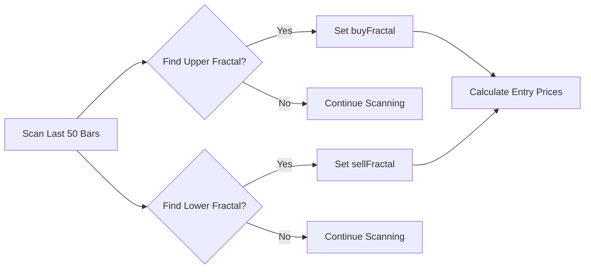
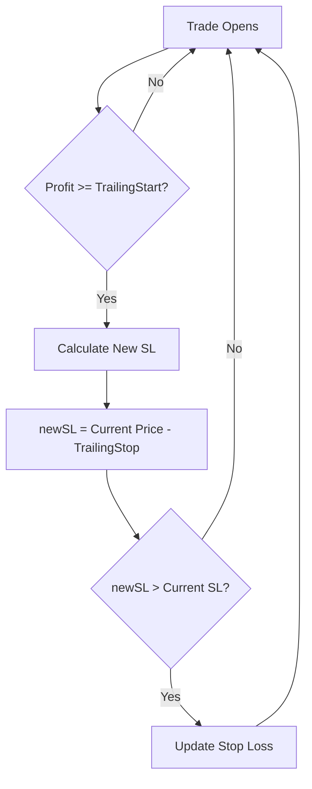
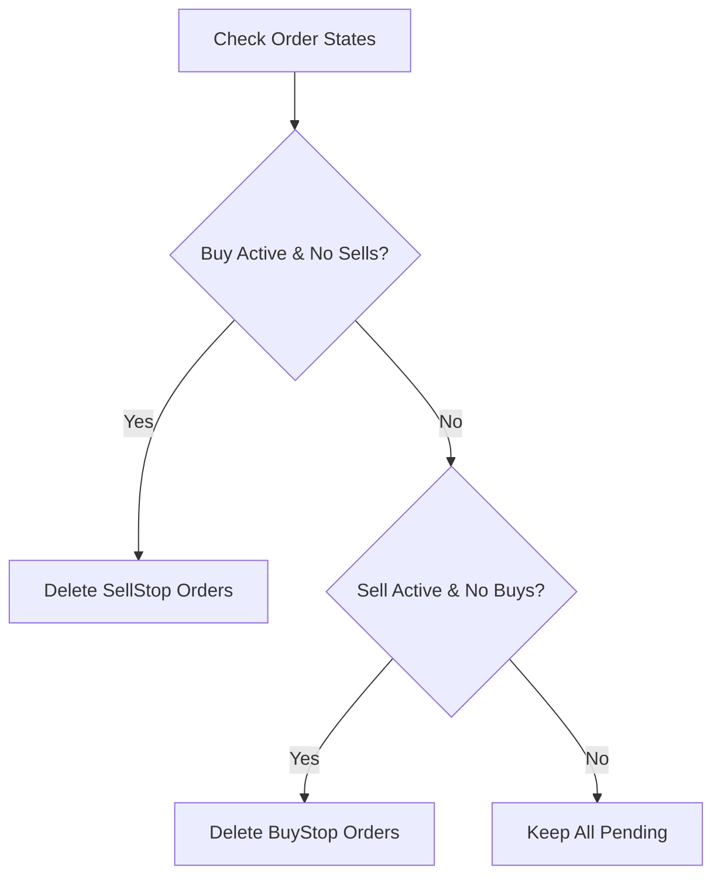
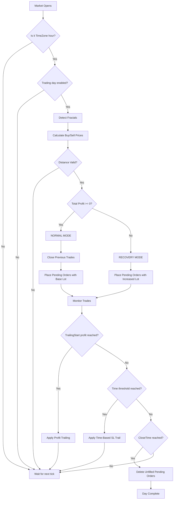

# 🦅 Falcon V5 - Modified Strategy Documentation

> A comprehensive guide to understanding the Falcon V5 Expert Advisor for MetaTrader 4

---

## 📑 Table of Contents

1. [Strategy Overview](#strategy-overview)
2. [Input Parameters](#input-parameters)
3. [Entry Logic](#entry-logic)
4. [Recovery Mode](#recovery-mode)
5. [Lot Size Management](#lot-size-management)
6. [Trailing Stop Mechanisms](#trailing-stop-mechanisms)
7. [Risk Management](#risk-management)
8. [Order Management](#order-management)
9. [Visual Indicators](#visual-indicators)
10. [Complete Workflow](#complete-workflow)

---

## Strategy Overview

The **Falcon V5** is a **fractal-based breakout strategy** that places pending orders (BuyStop & SellStop) at key fractal levels. The strategy incorporates:

- **Fractal Breakout Entry**: Uses Williams Fractals to identify potential breakout levels
- **Pending Order Placement**: Places BuyStop above upper fractal and SellStop below lower fractal
- **Recovery Mode**: Increases lot sizes when in drawdown to recover losses
- **Dual Trailing Stop Systems**: Both profit-based and time-based SL trailing
- **Comprehensive Risk Management**: Max drawdown protection, day-based trading filters

```
┌─────────────────────────────────────────────────────────────────┐
│                    FALCON V5 STRATEGY FLOW                      │
├─────────────────────────────────────────────────────────────────┤
│                                                                 │
│   📊 Market Open at TimeZone Hour                              │
│            ↓                                                    │
│   🔍 Detect Fractals (Upper & Lower)                           │
│            ↓                                                    │
│   📏 Validate Distance (MinDiff ← → MaxDiff)                   │
│            ↓                                                    │
│   📈 Check Running Profit/Loss                                 │
│            ↓                                                    │
│   ┌────────┴────────┐                                          │
│   │  Profit >= 0?   │                                          │
│   └────────┬────────┘                                          │
│      YES ↙     ↘ NO                                            │
│         ↓           ↓                                          │
│   NORMAL MODE   RECOVERY MODE                                  │
│   (Base Lot)    (Increased Lot)                                │
│         ↓           ↓                                          │
│   Place Pending Orders (BuyStop + SellStop)                    │
│            ↓                                                    │
│   Monitor with Trailing Stops                                  │
│                                                                 │
└─────────────────────────────────────────────────────────────────┘
```

---

## Input Parameters

### 📦 Lot Size Settings

| Parameter | Default | Description |
|-----------|---------|-------------|
| `Lot` | 0.01 | Initial lot size for normal trading |
| `LotIncrement` | 0.01 | Amount to add to lot size during recovery |
| `LotRepeater` | 2 | Number of cycles before lot size increases |

### 📍 Entry Settings

| Parameter | Default | Description |
|-----------|---------|-------------|
| `Candles` | 2 | Number of candles to check for high/low if price is beyond fractal |
| `Buffer` | 1 pip | Distance added above/below fractal for pending order placement |
| `MinDiff` | 1 pip | Minimum required distance between BuyStop and SellStop |
| `MaxDiff` | 160 pips | Maximum allowed distance between BuyStop and SellStop |

### 🎯 Take Profit & Stop Loss

| Parameter | Default | Description |
|-----------|---------|-------------|
| `TakeProfit` | 7 pips | Take profit distance for normal trades |
| `StopLoss` | 250 pips | Stop loss distance for all trades |
| `RecoveryTakeProfit` | 14 pips | Take profit distance for recovery trades |

### 📈 Profit-Based Trailing Stop

| Parameter | Default | Description |
|-----------|---------|-------------|
| `TrailingStart` | 10 pips | Profit in pips before trailing begins |
| `TrailingStop` | 5 pips | Distance from current price for trailing SL |

### ⏰ Time-Based SL Trailing

| Parameter | Default | Description |
|-----------|---------|-------------|
| `SL_TrailingStartDuration_Hours` | 6 | Hours after trade open to start trailing SL |
| `SL_TrailFrequency_Hours` | 2 | Interval in hours to trail SL |
| `SL_TrailDistance` | 20 pips | Distance to move SL each trail step |
| `SL_MaxTrailDifference` | 40 pips | Maximum SL distance from entry price |

### 📅 Trading Schedule

| Parameter | Default | Description |
|-----------|---------|-------------|
| `TimeZone` | 9 | GMT hour to place pending orders |
| `CloseTime` | "20:30" | Time to delete unfilled pending orders |
| `EnableMonday` | true | Allow trading on Monday |
| `EnableTuesday` | true | Allow trading on Tuesday |
| `EnableWednesday` | true | Allow trading on Wednesday |
| `EnableThursday` | true | Allow trading on Thursday |
| `EnableFriday` | true | Allow trading on Friday |

### ⚙️ Trade Configuration

| Parameter | Default | Description |
|-----------|---------|-------------|
| `MaxOrders` | 7 | Number of pending orders to place per direction |
| `TradeMode` | 0 | 0 = Both, 1 = Buy Only, 2 = Sell Only |
| `MaxDrawDown` | 99% | Maximum drawdown percentage before closing all trades |
| `Magic` | 1851 | Magic number to identify EA's trades |
| `TradeComment` | "EAGLE" | Comment attached to all trades |

---

## Entry Logic

### Step 1: Time-Based Trigger

The strategy only places new pending orders at a **specific hour** defined by `TimeZone`:

```
IF current_GMT_hour == TimeZone
   AND startflag == 0 (no orders placed today)
   AND trading is enabled for today's weekday
THEN → Proceed to entry logic
```

### Step 2: Fractal Detection

The EA scans the last 50 bars to find the **most recent Upper and Lower Fractals**:



### Step 3: Price Adjustment

If the current price is already beyond the fractal:

| Condition | Action |
|-----------|--------|
| `Ask > buyFractal` | Use highest high of last `Candles` bars + Buffer |
| `Bid < sellFractal` | Use lowest low of last `Candles` bars - Buffer |

### Step 4: Distance Validation

Entry proceeds only if the distance between buy and sell levels is within range:

```
buyPrice - sellPrice >= MinDiff  ✓
buyPrice - sellPrice <= MaxDiff  ✓
```

> [!IMPORTANT]
> If the distance is outside this range, **no orders are placed** for that day.

### Step 5: Order Placement

Based on `TradeMode`, the EA places up to `MaxOrders` pending orders:

| Trade Mode | Orders Placed |
|------------|---------------|
| 0 (Both) | BuyStop + SellStop |
| 1 (Buy Only) | BuyStop only |
| 2 (Sell Only) | SellStop only |

---

## Recovery Mode

When the total profit (including open trades and history since cycle start) is **negative**, the EA enters **Recovery Mode**.

### Recovery vs Normal Mode Comparison

| Aspect | Normal Mode | Recovery Mode |
|--------|-------------|---------------|
| **Trigger** | Total Profit ≥ 0 | Total Profit < 0 |
| **Take Profit** | `TakeProfit` (7 pips) | `RecoveryTakeProfit` (14 pips) |
| **Lot Size** | Base `Lot` | Progressively increased |
| **Cycle Count** | Starts at 1 | Continues incrementing |

### Recovery Mode Flow

```
┌─────────────────────────────────────────────────────────────┐
│                    RECOVERY MODE LOGIC                       │
├─────────────────────────────────────────────────────────────┤
│                                                              │
│   1. Check if cyclecnt % LotRepeater == 0                   │
│            ↓                                                 │
│   ┌────────┴────────┐                                       │
│   │   Multiple?     │                                       │
│   └────────┬────────┘                                       │
│      YES ↙     ↘ NO                                         │
│         ↓           ↓                                       │
│   Increase Lot   Keep Current Lot                           │
│   by LotIncrement                                           │
│         ↓           ↓                                       │
│   2. Place pending orders with updated lot                  │
│            ↓                                                 │
│   3. Increment cyclecnt                                     │
│            ↓                                                 │
│   4. If profit recovered (≥ 0) → Exit Recovery Mode         │
│                                                              │
└─────────────────────────────────────────────────────────────┘
```

### Example: Lot Progression with LotRepeater = 2

| Cycle | Lot Size | Explanation |
|-------|----------|-------------|
| 1 | 0.01 | Initial lot |
| 2 | 0.02 | Cycle 2 % 2 = 0 → Increase |
| 3 | 0.02 | Cycle 3 % 2 ≠ 0 → No increase |
| 4 | 0.03 | Cycle 4 % 2 = 0 → Increase |
| 5 | 0.03 | Cycle 5 % 2 ≠ 0 → No increase |
| 6 | 0.04 | Cycle 6 % 2 = 0 → Increase |

---

## Lot Size Management

### GetValidLot Function

Ensures lot sizes comply with broker requirements:

```
1. Check against MODE_MINLOT (minimum allowed)
2. Check against MODE_MAXLOT (maximum allowed)
3. Round to nearest MODE_LOTSTEP
```

### GetNextLot Function

Calculates the next lot size during recovery:

```
nextLot = currentLot + LotIncrement
nextLot = GetValidLot(nextLot)  // Validate with broker limits
```

---

## Trailing Stop Mechanisms

The EA implements **two independent trailing stop systems**:

### 1️⃣ Profit-Based Trailing (Original)

Triggered when trade profit reaches `TrailingStart` pips.



**Key Rules:**
- Buy trades: SL moves up only if `newSL > buySL` AND `newSL > OrderOpenPrice`
- Sell trades: SL moves down only if `newSL < sellSL` AND `newSL < OrderOpenPrice`

### 2️⃣ Time-Based SL Trailing (New Feature)

Trails SL based on **time elapsed** since trade opened, regardless of profit.

| Time Point | Action |
|------------|--------|
| 0 - 6 hours | No trailing (waiting period) |
| 6 hours | First SL trail (move by `SL_TrailDistance`) |
| 8 hours | Second SL trail |
| 10 hours | Third SL trail |
| ... | Continues every `SL_TrailFrequency_Hours` |

**Calculation Formula:**
```
number_of_trails = (timeElapsed - TrailingStartDuration) / TrailFrequency

For BUY:
  desired_SL = original_SL + (number_of_trails × SL_TrailDistance)
  Maximum SL = OrderOpenPrice - SL_MaxTrailDifference

For SELL:
  desired_SL = original_SL - (number_of_trails × SL_TrailDistance)
  Minimum SL = OrderOpenPrice + SL_MaxTrailDifference
```

> [!TIP]
> Time-based trailing is useful for reducing risk on trades that don't immediately move in your favor.

---

## Risk Management

### Maximum Drawdown Protection

If unrealized losses exceed `MaxDrawDown` percentage of account balance:

```
IF currentProfit <= -(AccountBalance × MaxDrawDown × 0.01)
THEN → CloseAllTrades() + Alert
```

### Auto-Close When No Orders Remain

When all orders (active and pending) are closed and total profit is negative:

1. Find profitable trades in history
2. Close the smallest profitable trades first to offset losses
3. Stop when losses are balanced

### Pending Order Cleanup

| Action | Trigger |
|--------|---------|
| Delete all pending orders | After `CloseTime` |
| Delete opposite pending orders | When one direction triggers |

**Example:** If BuyStop triggers → Delete all SellStop orders

---

## Order Management

### Order Counting Logic

The EA tracks four types of orders per cycle:

| Counter | Order Type |
|---------|------------|
| `buycnt` | Active Buy positions |
| `sellcnt` | Active Sell positions |
| `buystop` | Pending BuyStop orders |
| `sellstop` | Pending SellStop orders |

### Pending Order Deletion Rules



---

## Visual Indicators

### Chart Display

The EA displays the following on the chart:

| Element | Description |
|---------|-------------|
| **Comment Box** | Shows current GMT time and cycle count |
| **BuySL Line** | Pink horizontal line showing buy stop loss level |
| **SellSL Line** | Pink horizontal line showing sell stop loss level |

### Line Properties

```
Color: Pink (clrPink)
Width: 2 pixels
Style: Solid
```

---

## Complete Workflow

### Daily Trading Cycle



### State Variables Summary

| Variable | Purpose |
|----------|---------|
| `sTime` | Start time of current trading session |
| `cycleTime` | Start time of current cycle |
| `cyclecnt` | Number of cycles (for lot calculation) |
| `startflag` | 1 = Orders placed today, 0 = Not yet |
| `oneflag` | Controls order closing logic |
| `tempLot` | Current lot size (adjusted in recovery) |
| `isRecoveryMode` | Boolean tracking recovery state |
| `buySL` / `sellSL` | Current trailing stop loss levels |

---

## Quick Reference

### Entry Checklist ✅

- [ ] GMT hour equals `TimeZone`
- [ ] Today's weekday is enabled
- [ ] Fractals detected successfully
- [ ] Distance between levels is within MinDiff-MaxDiff range
- [ ] TradeMode allows the order direction

### Exit Conditions 🚪

| Exit Type | Trigger |
|-----------|---------|
| Take Profit | Price hits TP level |
| Stop Loss | Price hits SL level |
| Trailing SL | Price reverses to trailing SL |
| Max Drawdown | Account drawdown exceeds limit |
| Manual Close | Trader intervention |

### Recovery Exit ↩️

Recovery mode ends when:
```
Total Profit (History + Open Trades since sTime) >= 0
```

---

> [!NOTE]
> This documentation is based on Falcon V5 version 1.04. Parameters may need adjustment based on your broker's conditions and the instrument being traded.

---

*Documentation generated for Falcon V5 - Modified.mq4*
